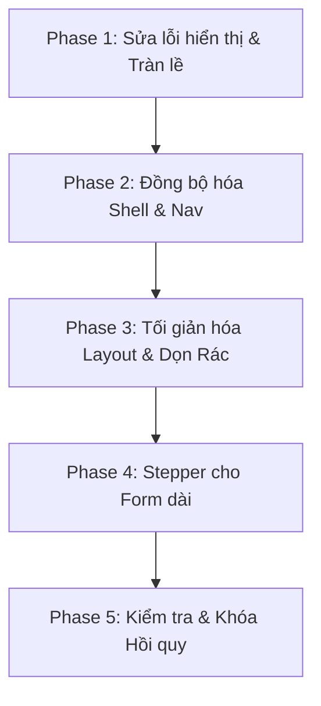

# Kế hoạch Refactor và Báo cáo Audit UI/UX PhongVu OpsHub (04/07/2026)

Tài liệu này ghi nhận kết quả đánh giá toàn diện giao diện người dùng (UI/UX) của ứng dụng PhongVu OpsHub trên 3 loại thiết bị: Desktop (Web), Tablet, và Mobile từ các ảnh chụp màn hình hiện có trong thư mục `.screenshot/`.

Báo cáo đối chiếu trực tiếp với các quy tắc thiết kế trong [ui-ux.md](product/ui-ux.md) để chỉ ra các điểm vi phạm, đề xuất hướng giải quyết kỹ thuật và lộ trình refactor chi tiết.

---

## 1. UI Audit Summary

1. **Lỗi Responsive & Overflow nghiêm trọng**: Màn hình Đăng nhập (Login) trên thiết bị di động bị tràn lề phải (clipping ngang) khiến form nhập liệu bị cắt mất, khiến người dùng hoàn toàn không thể thao tác đăng nhập.
2. **Che khuất thành phần điều khiển (UX Blockers)**: Trên thiết bị Mobile, nút kêu gọi hành động (CTA) chính "Gửi góp ý" của trang Phản hồi (Feedback) bị thanh điều hướng dưới (Bottom Navigation Bar) che khuất hoàn toàn, ngăn chặn việc gửi dữ liệu.
3. **Trải nghiệm Dropdown & Chọn Showroom chưa chuẩn hóa**: Dropdown chọn Showroom ở trang tạo VietQR chiếm toàn bộ chiều cao màn hình (Full-height list) và hoàn toàn thiếu thanh tìm kiếm nội bộ dù chứa trên 20 lựa chọn, trực tiếp vi phạm quy tắc thiết kế dropdown lớn.
4. **Mất nhất quán trong hệ thống điều hướng (Bottom Nav Bar)**: Thanh điều hướng dưới trên Mobile/Tablet hoạt động không đồng bộ, lúc hiển thị 4 mục (Trang chủ, Vận hành, Thông báo, Tài khoản), lúc lại chỉ có 3 mục (thiếu mục Vận hành).
5. **Rò rỉ thuật ngữ kỹ thuật và thông tin Staging ra UI (Technical leaks)**: Giao diện hiển thị trực tiếp các thông báo lỗi thô của API như `"property date should not exist"` hoặc các nhãn dữ liệu kỹ thuật như `"STAGING_QUERY"` và `"Staging FIFO result"`, gây nhiễu loạn thị giác và làm tăng cognitive load cho nhân viên vận hành.
6. **Card/Grid Layout bị lỗi hiển thị trên Web/Mobile**: Ở trang menu FIFO trên Web, thẻ "Cập nhật tồn kho" bị cắt xén lề phải do grid không wrap và mất hoàn toàn thẻ "Lịch sử FIFO". Trên Mobile, các thẻ chức năng ở cột phải bị cắt ngắn text.
7. **Lãng phí không gian hiển thị (White Space Waste)**: Nhiều trang menu nghiệp vụ (như FIFO Menu, Bảo hành Menu) hoặc các trang có kết quả rỗng (Kiểm tra FIFO, Sắp xếp FIFO) chiếm dụng diện tích viewport quá lớn để hiển thị khoảng trắng hoặc các thẻ trống vô nghĩa khi chưa thực hiện tra cứu.
8. **Mất nhất quán trong các chi tiết UI tương tự**: Vị trí biểu tượng quét mã QR nằm không đồng bộ giữa các trường nhập liệu (trái vs phải), biểu tượng nút submit khác nhau giữa các trang kiểm tra và sắp xếp (search vs send), và cơ chế phân trang (pagination) được triển khai theo 3 định dạng khác nhau trên toàn ứng dụng.

---

## 2. Screenshot Inventory

Dưới đây là danh mục các ảnh chụp giao diện trong thư mục `.screenshot/` đã được rà soát và phân loại:

*   **`page-login/`**: [web.png](../.screenshot/page-login/web.png), [mobile.png](../.screenshot/page-login/mobile.png), [tablet.png](../.screenshot/page-login/tablet.png) (Màn hình đăng nhập tài khoản).
*   **`page-home/`**: [web.png](../.screenshot/page-home/web.png), [mobile.png](../.screenshot/page-home/mobile.png), [tablet.png](../.screenshot/page-home/tablet.png) (Bảng điều khiển/Dashboard).
*   **`page-profile/`**: [web.png](../.screenshot/page-profile/web.png), [mobile.png](../.screenshot/page-profile/mobile.png), [tablet.png](../.screenshot/page-profile/tablet.png) (Thông tin cá nhân & Đăng xuất).
*   **`page-settings/`**: [web.png](../.screenshot/page-settings/web.png), [mobile.png](../.screenshot/page-settings/mobile.png), [tablet.png](../.screenshot/page-settings/tablet.png) (Cài đặt theme và khởi động ứng dụng).
*   **`page-operations/`**: [web.png](../.screenshot/page-operations/web.png), [mobile.png](../.screenshot/page-operations/mobile.png), [tablet.png](../.screenshot/page-operations/tablet.png) (Catalog tính năng nghiệp vụ).
*   **`page-fifo-menu/`**, **`page-fifo-check/`**, **`page-fifo-history/`**, **`page-fifo-inventory-import/`**: Các màn hình của phân hệ quản lý kho FIFO.
*   **`page-sort/`**: Giao diện hỗ trợ sắp xếp vị trí kho hàng.
*   **`page-warranty-main/`**, **`page-warranty/`**, **`page-check-warranty/`**: Các màn hình tiếp nhận và tra cứu hình ảnh bảo hành/sửa chữa.
*   **`page-vietqr/`**: Form tạo mã QR chuyển khoản và lịch sử giao dịch.
*   **`page-payment-monitor/`**: Theo dõi tiền vào thời gian thực tại các showroom.
*   **`page-bank-statement/`**: Rà soát đối chiếu sao kê ngân hàng theo mã đơn.
*   **`page-offset-adjustments/`**: Form và danh sách yêu cầu cấn trừ tài chính.
*   **`page-feedback/`**: Form đóng góp ý kiến của nhân viên.
*   **`page-help/`**: Tài liệu hướng dẫn sử dụng và roadmap phát triển.
*   **`panel-home-notifications/`**: Panel ngăn kéo thông báo hệ thống.
*   **`menu-home-account/`**: Menu thả xuống thông tin tài khoản ở top bar.
*   **`dialog-home-app-info/`**: Dialog thông tin phiên bản phần mềm.
*   **`modal-offset-adjustments-request-detail/`**: Dialog chi tiết một yêu cầu cấn trừ.

---

## 3. Issues by Screen

### Màn hình: Đăng nhập (`/login`)
*   **Screenshot**: [mobile.png](../.screenshot/page-login/mobile.png), [web.png](../.screenshot/page-login/web.png)
*   **Mục đích màn hình**: Xác thực người dùng bằng email và mật khẩu để cấp quyền truy cập hệ thống.
*   **Vấn đề**:
    1.  **[Critical] Tràn giao diện ngang (Horizontal Overflow) trên Mobile**: Form nhập email và mật khẩu bị đẩy và cắt xén hoàn toàn bên phải màn hình. Người dùng không thể nhìn thấy đầy đủ các trường nhập và không thể bấm nút Đăng nhập.
        *   *Evidence*: Ảnh `mobile.png` hiển thị logo lệch và form bị cắt mất 80% diện tích bên phải.
        *   *Likely cause*: Sử dụng layout 2 cột cố định (`Row` không responsive) trên màn hình hẹp khiến cột form bên phải bị overflow.
        *   *Recommended fix*: Chuyển đổi layout sang đơn cột (stacked) khi chiều rộng màn hình `< 600px`, ẩn bảng giới thiệu tính năng bên trái và đưa form đăng nhập vào trung tâm.
    2.  **[High] Lỗi logic validation sớm**: Hiển thị viền và chữ cảnh báo màu đỏ trên trường Email ngay cả khi người dùng đã nhập đúng hoặc mới mở form.
        *   *Evidence*: Ảnh `_tmp-login-filled-web.png` hiển thị email hợp lệ nhưng viền trường nhập vẫn đỏ.
        *   *Likely cause*: Logic validation trigger quá sớm trên sự kiện `onChanged` thay vì `onSubmitted` hoặc khi submit form.
        *   *Recommended fix*: Chỉ kích hoạt validation khi nhấn nút Submit hoặc sau khi trường nhập mất focus (`focusNode.unfocus()`).
*   **Component/code liên quan**: `EmailCheckScreen` tại [email_check_screen.dart](../lib/features/auth/presentation/screens/email_check_screen.dart) và `AuthScreenShell`.
*   **Ưu tiên xử lý**: Critical.

---

### Màn hình: Góp ý (`/feedback`)
*   **Screenshot**: [mobile.png](../.screenshot/page-feedback/mobile.png)
*   **Mục đích màn hình**: Cho phép nhân viên gửi phản hồi, lỗi hệ thống hoặc đóng góp ý kiến về phòng ban vận hành.
*   **Vấn đề**:
    1.  **[Critical] Che khuất nút bấm Submit trên Mobile**: Nút "Gửi góp ý" nằm ở cuối màn hình bị thanh điều hướng dưới (Bottom Navigation Bar) che đè lên, khiến nhân viên không thể bấm nút gửi.
        *   *Evidence*: Ảnh `mobile.png` của feedback chỉ hiển thị một phần viền xanh rất nhỏ của nút submit dưới bottom nav.
        *   *Likely cause*: Form không tính toán phần đệm an toàn (safe area padding) hoặc vị trí cuộn bị cản trở bởi bottom nav tĩnh.
        *   *Recommended fix*: Bọc nút bấm trong khu vực an toàn bằng `SafeArea` hoặc sử dụng một `sticky footer` có đệm tương ứng với chiều cao bottom nav.
*   **Component/code liên quan**: [feedback_screen.dart](../lib/features/feedback/presentation/screens/feedback_screen.dart).
*   **Ưu tiên xử lý**: Critical.

---

### Màn hình: Menu FIFO (`/fifo-menu`)
*   **Screenshot**: [web.png](../.screenshot/page-fifo-menu/web.png), [mobile.png](../.screenshot/page-fifo-menu/mobile.png)
*   **Mục đích màn hình**: Menu trung tâm điều hướng các tính năng liên quan đến quản lý tồn kho FIFO.
*   **Vấn đề**:
    1.  **[Critical] Tràn card và biến mất tính năng trên Web**: Thẻ chức năng thứ 3 "Cập nhật tồn kho" bị cắt xén văn bản ở mép phải. Thẻ thứ 4 "Lịch sử FIFO" bị biến mất hoàn toàn khỏi giao diện.
        *   *Evidence*: Ảnh `web.png` của `page-fifo-menu` chỉ hiện 3 card trên một hàng và card cuối cùng bị cắt text.
        *   *Likely cause*: Bố cục GridView/Row sử dụng chiều rộng thẻ cố định và thiếu thuộc tính tự động xuống dòng (wrap behavior).
        *   *Recommended fix*: Enforce `AppFeatureGrid` tự động tính toán số cột dựa trên viewport (ví dụ: dùng wrap hoặc `SliverGridDelegateWithMaxCrossAxisExtent`).
    2.  **[Critical] Cắt cụt nhãn chữ trên Mobile**: Nhãn của các card ở cột phải bị cắt ngắn và thêm dấu ba chấm, làm mất ý nghĩa của tính năng ("Sắp xếp" -> "Sắp xếp", "Lịch sử" -> "Lịch sử...").
        *   *Evidence*: Ảnh `mobile.png` hiển thị các card bị bóp hẹp bề ngang.
        *   *Recommended fix*: Tối ưu hóa padding của card trên mobile và cấu hình cỡ chữ tự động co giãn nhẹ.
*   **Component/code liên quan**: [fifo_menu_screen.dart](../lib/features/fifo/presentation/screens/fifo_menu_screen.dart).
*   **Ưu tiên xử lý**: Critical.

---

### Màn hình: VietQR (`/vietqr`)
*   **Screenshot**: [web.png](../.screenshot/page-vietqr/web.png), [dropdown-vietqr-showroom/web.png](../.screenshot/dropdown-vietqr-showroom/web.png)
*   **Mục đích màn hình**: Tạo mã QR động để khách hàng quét chuyển khoản tại showroom.
*   **Vấn đề**:
    1.  **[Critical] Dropdown Showroom chiếm toàn bộ chiều cao và thiếu ô tìm kiếm**: Khi bấm chọn showroom, một danh sách dài dằng dặc xuất hiện che phủ toàn bộ màn hình từ trên xuống dưới, không có ô nhập từ khóa để tìm nhanh.
        *   *Evidence*: Ảnh `dropdown-vietqr-showroom/web.png` hiển thị danh sách showroom tràn viewport dọc.
        *   *Likely cause*: Sử dụng popup dropdown mặc định của Flutter mà không giới hạn chiều cao tối đa (`maxHeight`) và không tích hợp thanh search.
        *   *Recommended fix*: Thay thế dropdown này bằng component dùng chung `AppSearchableFilterDropdown` hoặc `ShowroomPicker` có giới hạn chiều cao ~300px và tích hợp ô tìm kiếm ở đầu panel.
*   **Component/code liên quan**: [vietqr_screen.dart](../lib/features/vietqr/presentation/screens/vietqr_screen.dart).
*   **Ưu tiên xử lý**: Critical.

---

### Màn hình: Sao kê (`/bank-statement`)
*   **Screenshot**: [mobile.png](../.screenshot/page-bank-statement/mobile.png)
*   **Mục đích màn hình**: Rà soát, tìm kiếm và đối chiếu các giao dịch ngân hàng theo bộ lọc.
*   **Vấn đề**:
    1.  **[Critical] Thiếu nút bấm hành động Tìm khi thu gọn bộ lọc trên Mobile**: Khi bộ lọc tìm kiếm được thu gọn (collapsed) để tiết kiệm không gian, các nút bấm "Tìm" và "Xuất file" bị giấu đi mất, người dùng không thể thực hiện tìm kiếm.
        *   *Evidence*: Ảnh `mobile.png` của bank statement chỉ hiển thị panel "Bộ lọc tìm kiếm" đã đóng và không có cách nào kích hoạt lệnh tra cứu.
        *   *Likely cause*: Nút hành động được đặt bên trong container của filter panel bị ẩn đi khi collapse.
        *   *Recommended fix*: Đưa nút "Tìm" (dạng primary action) ra ngoài panel, hiển thị thường trực cạnh thanh header hoặc thanh trạng thái.
*   **Component/code liên quan**: [bank_statement_screen.dart](../lib/features/bank_statement/presentation/screens/bank_statement_screen.dart).
*   **Ưu tiên xử lý**: Critical.

---

### Màn hình: Thông tin ứng dụng (`dialog-home-app-info`)
*   **Screenshot**: [web.png](../.screenshot/dialog-home-app-info/web.png)
*   **Mục đích màn hình**: Hiển thị thông tin phiên bản ứng dụng PhongVu OpsHub.
*   **Vấn đề**:
    1.  **[Critical] Rò rỉ thông báo lỗi kỹ thuật thô**: Phía sau dialog thông tin, giao diện chính đang hiển thị một dòng thông báo lỗi lập trình màu đỏ: `"property date should not exist"`.
        *   *Evidence*: Ảnh `web.png` của dialog app-info lộ rõ thông báo lỗi phía sau.
        *   *Likely cause*: Lỗi API trả về cấu trúc dữ liệu không khớp và được hiển thị thô mà không qua bộ lọc mapper thông báo thân thiện.
        *   *Recommended fix*: Chèn lớp trung gian map lỗi tại API client, chuyển đổi các Exception kỹ thuật thành ngôn ngữ vận hành: `"Không thể đồng bộ dữ liệu lúc này. Vui lòng thử lại."`
*   **Component/code liên quan**: [app.dart](../lib/app/app.dart) và `AppShell` dialog.
*   **Ưu tiên xử lý**: Critical.

---

### Màn hình: Xem lại bảo hành (`/check-warranty`)
*   **Screenshot**: [web.png](../.screenshot/page-check-warranty/web.png), [mobile.png](../.screenshot/page-check-warranty/mobile.png)
*   **Mục đích màn hình**: Tìm kiếm hình ảnh biên nhận bảo hành theo mã số.
*   **Vấn đề**:
    1.  **[Critical] Nút điều hướng bị cắt cụt chữ (Text Truncation)**: Nút chuyển hướng quay lại trang chính bảo hành bị cắt cụt text thành `"Về bảo h..."` trên toàn bộ cả 3 nền tảng Web, Tablet và Mobile.
        *   *Evidence*: Text hiển thị `"Về bảo h..."` thay vì `"Về bảo hành"`.
        *   *Likely cause*: Chiều rộng tối đa của nút bấm bị giới hạn cứng quá hẹp không tương thích với độ dài chuỗi text tiếng Việt.
        *   *Recommended fix*: Loại bỏ giới hạn chiều rộng cứng, cho phép nút co giãn tự nhiên theo kích thước text (IntrinsicWidth) hoặc tối ưu hóa nhãn thành `"Quay lại"`.
*   **Component/code liên quan**: [check_warranty_screen.dart](../lib/features/warranty/presentation/screens/check_warranty_screen.dart).
*   **Ưu tiên xử lý**: Critical.

---

## 4. Cross-screen Design Problems

### 4.1 Spacing & Padding không đồng nhất
*   **Mô tả**: Khoảng đệm rìa (padding) của trang trên Mobile dao động tùy tiện từ 12px đến 20px tùy thuộc vào màn hình.
*   **Ảnh hưởng**: Giao diện bị giật cục khi chuyển trang. Form nhập liệu trên các thiết bị màn hình nhỏ (như iPhone SE) bị bóp hẹp khoảng trống nhập liệu gây tràn viền.
*   **Giải pháp**: Enforce sử dụng token `AppLayoutTokens.pagePadding` ở tất cả các view.

### 4.2 Card styles lạm dụng mật độ cao
*   **Mô tả**: Sử dụng `AppSurfaceCard` cho hầu hết mọi loại dữ liệu (bao gồm cả các hàng danh sách dữ liệu dày đặc).
*   **Ảnh hưởng**: Tạo ra quá nhiều đường kẻ (border) và khoảng đệm (padding) lồng nhau, giảm mật độ thông tin hữu ích trên Desktop.
*   **Giải pháp**: Tách biệt rõ ràng: `SummaryCard` (chỉ số), `FormSection` (nhóm form), và `DataRow` (bảng dữ liệu, dùng border-bottom thay vì bọc card).

### 4.3 Nút bấm (Button Variants) mất nhất quán
*   **Mô tả**: Cùng một nút bấm "Cập nhật tồn kho" nhưng trên Web dùng filled light blue nhạt, trên Mobile lại dùng filled orange/blue đậm. Nút "Xuất file" bị vô hiệu hóa (disabled) nhưng lúc thì tô màu xám, lúc thì outlined mờ mà không có tooltip giải thích lý do.
*   **Giải pháp**: Chuẩn hóa nút bấm thông qua bộ component `AppPrimaryButton`, `AppSecondaryButton` và cấm sử dụng nút thô của SDK.

### 4.4 Các cơ chế Phân trang (Pagination) phân mảnh
*   **Mô tả**: 3 màn hình nghiệp vụ sử dụng 3 kiểu phân trang khác nhau:
    *   Payment Monitor: `"Trang 1 - 0 GD"` (Mobile) vs `"Trang 1 - 0 giao dịch"` (Web).
    *   Bank Statement: Chỉ hiển thị nút `"Trang 1"`, không có tổng số.
    *   Offset Adjustments: Hiển thị `"2 / 2 hồ sơ"` kèm nút điều hướng `"< 1 >"`.
*   **Giải pháp**: Tạo component chung `AppPagination` hiển thị định dạng chuẩn: `[Trang X/Y] [Nút Trước] [Nút Sau] [Tổng số bản ghi]`.

### 4.5 Vị trí icon quét mã QR không đồng bộ
*   **Mô tả**: Ở trang nhập bảo hành, icon QR Code nằm bên trong trường nhập (suffixIcon). Ở trang tra cứu bảo hành, icon QR Code lại nằm bên ngoài, đứng độc lập bên trái trường nhập.
*   **Giải pháp**: Thống nhất quy tắc: Mọi trường nhập hỗ trợ quét mã đều phải đặt icon QR ở vị trí `suffixIcon` của trường nhập đó.

---

## 5. Refactor Plan



### Phase 1 — Foundation & Hotfixes (Thời gian: 3 ngày)
*   **Mục tiêu**: Sửa triệt để các lỗi tràn lề (overflow) và che nút bấm cản trở tác vụ cốt lõi.
*   **Công việc**:
    1.  Tách breakpoint màn hình Login: Dưới 600px ẩn cột giới thiệu bên trái, đưa form login về trung tâm full-screen.
    2.  Bọc layout phản hồi (Feedback) bằng `SafeArea` kết hợp với khoảng đệm đáy linh hoạt (padding-bottom tương thích bottom nav).
    3.  Tối ưu hóa min-width của nút `"Về bảo hành"` trong Warranty, ngăn chặn text clipping.
    4.  Giới hạn chiều cao dropdown Showroom trong VietQR ở mức tối đa `320px` bằng `Constraints` và tích hợp thanh search ở đầu.

### Phase 2 — Navigation & Bottom Nav Sync (Thời gian: 3 ngày)
*   **Mục tiêu**: Đảm bảo thanh điều hướng hoạt động nhất quán, không mất mát tính năng.
*   **Công việc**:
    1.  Cấu hình lại `AppNavModel` để tab "Vận hành" luôn xuất hiện đồng bộ trên thanh điều hướng dưới trên mọi màn hình của Mobile/Tablet.
    2.  Khắc phục lỗi mất thẻ "Lịch sử FIFO" trên Web: Chuyển đổi grid của FIFO Menu sang cơ chế tự động wrap dòng.
    3.  Xóa bỏ các icon Chevron chỉ hướng trên thanh Sidebar của Desktop vì đây là mô hình điều hướng phẳng (click là chuyển trang).

### Phase 3 — Layout Primitives & Cleanup (Thời gian: 4 ngày)
*   **Mục tiêu**: Loại bỏ các Header giới thiệu tính năng dài dòng, tối đa hóa không gian thao tác nghiệp vụ.
*   **Công việc**:
    1.  Xóa bỏ triệt để các Header Card màu mè giới thiệu tính năng ở các trang con (FIFO Check, Warranty Main).
    2.  Thu nhỏ banner thông tin cá nhân cồng kềnh trên Trang chủ Mobile thành một dòng chào ngắn sát Top Bar.
    3.  Tách biệt layout empty state: Giảm kích thước vùng trống từ 70% xuống mức hợp lý khi chưa có dữ liệu, đưa khu vực nhập liệu lên tiêu điểm đầu trang.

### Phase 4 — Stepper & Progressive Forms (Thời gian: 5 ngày)
*   **Mục tiêu**: Chia nhỏ form Báo cáo chưa mua dài 3.800px thành nhiều bước hợp lý (Wizard Flow).
*   **Công việc**:
    1.  Triển khai component `AppStepper` hỗ trợ 4 bước:
        *   *Bước 1*: Thông tin Khách hàng (SĐT, Loại KH).
        *   *Bước 2*: Phân loại nhu cầu & Ngành hàng.
        *   *Bước 3*: Ghi nhận quá trình tư vấn & trải nghiệm thực tế (chỉ hiện các câu hỏi liên quan).
        *   *Bước 4*: Lý do chưa mua hàng & Xem lại toàn bộ (Review) trước khi gửi.
    2.  Bổ sung chức năng tự động lưu bản nháp cục bộ (Auto-save draft) bằng `SharedPreferences` phòng khi mất kết nối mạng.

### Phase 5 — Verification & Automation Guards (Thời gian: 2 ngày)
*   **Mục tiêu**: Viết bổ sung các bài test tự động để khóa chặt thiết kế, ngăn chặn UI bị trôi lệch sau này.
*   **Công việc**:
    1.  Bổ sung widget test đo lường chiều rộng của form trên màn hình Desktop giả lập để xác minh giới hạn `contentMaxWidth`.
    2.  Cập nhật `design_system_migration_guard_test.dart` chặn việc viết trực tiếp các từ viết tắt nội bộ mới hoặc lạm dụng scaffold lồng nhau.

---

## 6. Implementation Tasks

### 1. Sửa lỗi Responsive & Tràn lề trang Login
*   **Scope**: Auth UI
*   **Files**: [email_check_screen.dart](../lib/features/auth/presentation/screens/email_check_screen.dart), `auth_screen_shell.dart`
*   **Acceptance criteria**:
    *   Màn hình Login ở viewport `390x844` (mobile) không bị lỗi overflow ngang.
    *   Form nhập liệu hiển thị đầy đủ, căn giữa, nút Đăng nhập hiển thị rõ ràng.
    *   Validation lỗi chỉ xuất hiện khi submit form hoặc khi mất focus, không hiện lỗi ngay khi vừa mở trang.
*   **Estimate**: S
*   **Dependencies**: None

### 2. Sửa lỗi che nút Submit trang Phản hồi (Feedback)
*   **Scope**: Feedback UI
*   **Files**: [feedback_screen.dart](../lib/features/feedback/presentation/screens/feedback_screen.dart)
*   **Acceptance criteria**:
    *   Nút bấm "Gửi góp ý" hiển thị trọn vẹn trên Mobile và nằm hoàn toàn phía trên thanh Bottom Nav Bar.
    *   Khi cuộn trang xuống cuối, không xảy ra hiện tượng chồng chéo Layout.
*   **Estimate**: S
*   **Dependencies**: None

### 3. Tái cấu trúc Dropdown Showroom trong VietQR
*   **Scope**: VietQR UI
*   **Files**: [vietqr_screen.dart](../lib/features/vietqr/presentation/screens/vietqr_screen.dart)
*   **Acceptance criteria**:
    *   Bấm chọn showroom không mở dropdown tràn toàn bộ màn hình dọc.
    *   Chiều cao dropdown giới hạn tối đa `320px`.
    *   Có thanh tìm kiếm text ở đầu danh sách showroom để lọc nhanh.
*   **Estimate**: M
*   **Dependencies**: Component ShowroomPicker hoặc AppSearchableFilterDropdown.

### 4. Đồng bộ hóa Bottom Navigation Bar trên Mobile
*   **Scope**: Navigation Shell
*   **Files**: `app_shell.dart`, `app_nav_model.dart`
*   **Acceptance criteria**:
    *   Tab "Vận hành" xuất hiện đầy đủ và nhất quán trên bottom nav của mọi trang trên Mobile.
    *   Không xảy ra hiện tượng nhảy số lượng tab (3 tab vs 4 tab) khi chuyển trang.
*   **Estimate**: S
*   **Dependencies**: None

### 5. Thiết kế Form Báo cáo chưa mua dạng Stepper (Wizard)
*   **Scope**: Sales Report Form
*   **Files**: [sales_report_screen.dart](../lib/features/sales_report/presentation/screens/sales_report_screen.dart)
*   **Acceptance criteria**:
    *   Form không trải dài 3.800px, thay vào đó hiển thị theo 4 bước nhỏ.
    *   Có chỉ báo tiến độ (ProgressBar hoặc Step Indicator) ở đầu form.
    *   Chỉ hiển thị các câu hỏi nhánh phụ dựa trên câu trả lời của bước trước.
    *   Có nút "Quay lại" và "Tiếp tục" ở chân trang.
*   **Estimate**: L
*   **Dependencies**: None

---

## 7. Suggested Component Structure

Khuyến nghị tổ chức lại thư mục component dùng chung trong `lib/app/widgets/` theo phân nhóm chức năng để dễ quản lý và tìm kiếm:

```txt
lib/app/widgets/
  ├── layout/
  │     ├── app_shell.dart              # Persistent sidebar / Bottom nav shell
  │     ├── app_layout.dart             # Responsive breakpoints & limits
  │     └── app_responsive_content.dart  # Desktop max-width boundary
  ├── data_entry/
  │     ├── app_inputs.dart             # Standardized text fields
  │     ├── app_buttons.dart            # Primary, Secondary & Icon buttons
  │     └── showroom_picker.dart        # Searchable showroom dropdown
  ├── data_display/
  │     ├── app_cards.dart              # Card surfaces
  │     ├── app_chips.dart              # Metadata status chips & pills
  │     └── app_pagination.dart         # Standardized pagination controls
  └── feedback/
        ├── app_state_widgets.dart      # Loading, empty, error panels
        └── app_shimmer_skeleton.dart   # Animated shimmer loading skeleton
```

---

## 8. Coding Guidelines

Để ngăn ngừa hiện tượng trôi lệch thiết kế (design drift) trong tương lai, toàn bộ lập trình viên phải tuân thủ nghiêm ngặt các quy tắc sau:

1.  **Cấm Hard-code Spacing & Radius**: Tuyệt đối không viết các giá trị khoảng cách hoặc góc bo trực tiếp (ví dụ: `SizedBox(height: 10)` hoặc `BorderRadius.circular(8)`). Bắt buộc sử dụng tokens:
    *   *Spacing*: `AppLayoutTokens.formFieldGap`, `AppLayoutTokens.formInlineGap`, `AppLayoutTokens.cardGap`.
    *   *Radius*: `AppRadius.card`, `AppRadius.button`, `AppRadius.input`.
2.  **Cấm sử dụng trực tiếp các Button SDK**: Không sử dụng `ElevatedButton`, `OutlinedButton`, `FilledButton`, `TextButton` thô. Bắt buộc dùng `AppPrimaryButton`, `AppSecondaryButton`.
3.  **Bảo vệ Viewport bằng Responsive Primitives**: Tất cả các màn hình mới bắt buộc phải bọc ngoài bằng `AppResponsiveContent` hoặc `AppResponsiveScrollView` để tự động khống chế chiều rộng trên Desktop/Web.
4.  **Error Handling thân thiện người dùng**: Mọi thông điệp lỗi API trả về phải đi qua một helper mapping tiếng Việt trước khi render lên UI. Nghiêm cấm hiển thị raw exception hoặc các thuật ngữ backend.
5.  **Cung cấp trạng thái Loading & Empty**: Bất kỳ màn hình nào tải dữ liệu từ API đều phải có trạng thái loading dạng skeleton (`AppListSkeleton`) và trạng thái trống (`AppStatePanel.empty`) được thiết kế chỉn chu.

---

## 9. UI/UX Rule Compliance

| Màn hình | Screenshot | Rule liên quan trong `ui-ux.md` | Trạng thái | Vấn đề phát hiện | Hướng xử lý đề xuất | Cần sửa `ui-ux.md`? |
| :--- | :--- | :--- | :--- | :--- | :--- | :--- |
| **Login** | `page-login/mobile.png` | "mobile uses one-column touch-first layouts" | 🔴 Vi phạm | Form đăng nhập bị cắt ngang lề phải trên mobile do layout 2 cột cố định. | Thêm breakpoint ẩn panel trái trên mobile. | Không. |
| **Feedback** | `page-feedback/mobile.png` | "Show state clearly: every... state must be visible" | 🔴 Vi phạm | Nút Submit "Gửi góp ý" bị thanh Bottom Nav che mất hoàn toàn. | Thêm safe area padding tương ứng ở chân trang. | Không. |
| **VietQR** | `dropdown-vietqr-showroom` | "Any filter dropdown with >10 items must include search" | 🔴 Vi phạm | Dropdown chọn showroom dài và chiếm full height dọc, không có search. | Thay thế bằng searchable picker, giới hạn chiều cao tối đa. | Không. |
| **Bank Statement** | `page-bank-statement` | "Show state clearly... action row matches" | 🔴 Vi phạm | Ẩn nút "Tìm" khi thu gọn filter trên mobile. Nút "Xuất" disabled không lý do. | Đưa nút Tìm ra ngoài panel. Thêm tooltip/giải thích cho nút disabled. | Không. |
| **Check Warranty** | `page-check-warranty` | "Button labels must be short verbs... action-oriented" | 🔴 Vi phạm | Nút quay lại bị cắt chữ thành `"Về bảo h..."` trên cả 3 viewports. | Đổi nhãn thành `"Quay lại"` hoặc tăng chiều rộng co giãn tự nhiên. | Không. |
| **FIFO History** | `page-fifo-history` | "Do not expose backend, provider, database terms..." | 🔴 Vi phạm | Hiển thị raw string `"STAGING_QUERY"` và `"Staging FIFO result"`. | Map các nhãn dữ liệu QA sang tiếng Việt thân thiện hơn. | Không. |

---

## 10. Proposed `ui-ux.md` Changes

Sau khi rà soát, em phát hiện tài liệu `ui-ux.md` hiện tại còn thiếu một số quy tắc quan trọng để giải quyết triệt để các vấn đề visual phát hiện được. Em đề xuất bổ sung các quy tắc mới sau:

### 10.1 Bổ sung vào Section "Standard Components" (Quy tắc Form Stepper)
*   **Rule mới đề xuất**: Các biểu mẫu (Form) nghiệp vụ thu thập dữ liệu có số lượng trường nhập liệu lớn hơn 10 trường (hoặc có chiều cao cuộn thực tế trên mobile > 1.500px) bắt buộc phải được chia nhỏ và hiển thị dưới dạng luồng nhiều bước (Stepper/Wizard Flow). Không trải phẳng toàn bộ form.
*   **Lý do**: Giảm tải nhận thức (cognitive load) cho nhân viên và ngăn ngừa lỗi điền thiếu/sai lệch dữ liệu do phải cuộn quá dài.

### 10.2 Bổ sung vào Section "Platform Contracts" (Quy tắc Safe Area & Bottom Nav)
*   **Rule mới đề xuất**: Trên thiết bị Mobile, các thành phần điều khiển hành động chính ở chân trang (như sticky action buttons, submit buttons) bắt buộc phải chèn một khoảng đệm an toàn tối thiểu `80px` (bằng chiều cao Bottom Nav Bar + padding) để tránh bị thanh điều hướng hoặc vùng an toàn hệ thống (iOS home indicator) che khuất.
*   **Lý do**: Khắc phục lỗi che đè nút submit trang Feedback.

### 10.3 Bổ sung vào Section "Filter Controls" (Quy tắc Showroom Selector dùng chung)
*   **Rule mới đề xuất**: Rút gọn toàn bộ các selector showroom riêng lẻ. Mọi luồng cần chọn Showroom trong app (VietQR, Tiền vào, Sao kê, Cấn trừ) bắt buộc phải tái sử dụng component duy nhất `ShowroomPicker` có hỗ trợ tìm kiếm và giới hạn chiều cao hiển thị.
*   **Lý do**: Thống nhất hành vi người dùng, tránh việc trang thì có search trang thì không.

---

*Tài liệu này đã sẵn sàng để tích hợp trực tiếp vào hướng dẫn phát triển của dự án.*
